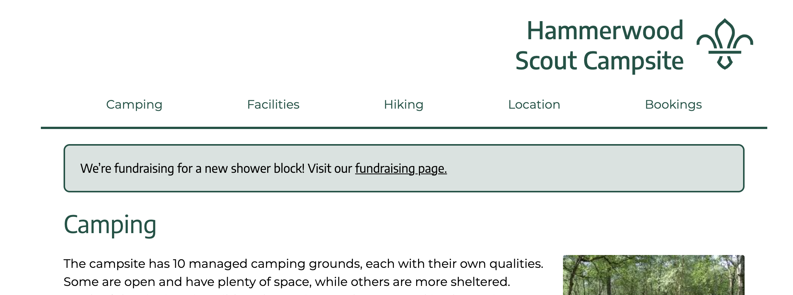
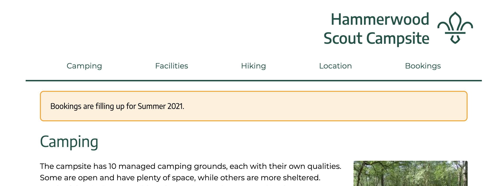
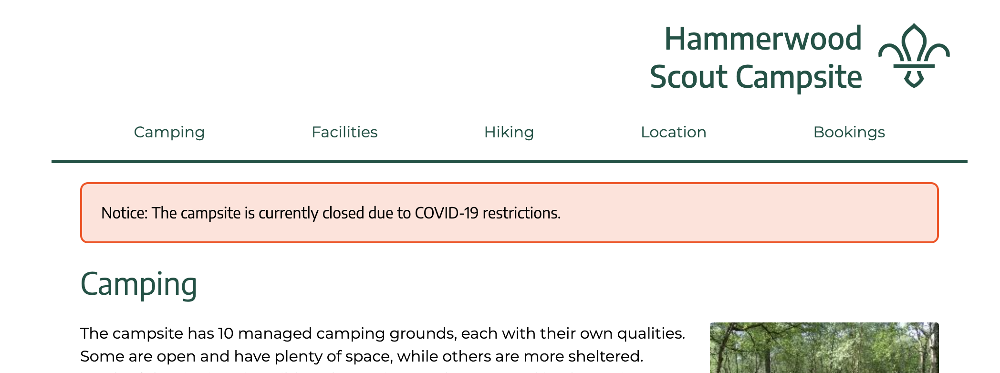

# Hammerwood Website

This is the website for the Hammerwood Scout Campsite

## Deployment

The website is hosted on [Netlify](https://netlify.app/) and is configured to automatically deploy on commits to the `master` branch.

No further action should be necessary but in the event that a change isn’t deployed, contact Thirza for further information.

## Development

### Project Overview

This project uses [SCSS](https://sass-lang.com/) as a CSS preprocessor which converts the `main.scss` file to a `main.css` file when built. If you don’t know SCSS syntax, that’s ok, all CSS syntax is still completely valid and should work just fine.

The `/layouts/layout.html` file is a wrapper html file which wraps each “page” in the `/pages` directory. The layout has the all the html that is shared across all pages (header, navigation, footer). Each “page” file is html that is inserted into the `<main>` element of the final html file.

#### Announcements

The html for the announcements is in the `layouts/layout.html` file and as such is shown on all pages. The announcement banner supports 3 styles; an informational green style, a warning orange style, and a more sever red style. The style of the announcement is based on the classes added Shown in the following examples.

<details>
<summary>Green Banner</summary>



To use this banner, use only the “announcement” class on its own.

```html
<div class="announcement">…</div>
```

</details>

<details>
<summary>Orange Banner</summary>



To use this banner, use both “announcement” and “orange” classes.

```html
<div class="announcement orange">…</div>
```

</details>

<details>
<summary>Red Banner</summary>



To use this banner, use both “announcement” and “red” classes.

```html
<div class="announcement red">…</div>
```

</details>

### Prerequisites

This project uses node to build the files and node’s package manager, npm, for managing the required dependencies. You will need these installed to run the website locally.

- node > v12.x (npm > v6.x)

### Running Locally

The following commands are run in the command line

Clone the repository

```
git clone git@github.com:hammerwood-scouts/hammerwoodwebsite.git
cd hammerwoodwebsite
```

Install dependencies

```
npm install
```

Run development server

```
npm run dev
```

### Scripts

There are some scripts that can be run in the command line

| Script         | Description                                                                                                                                         |
| -------------- | --------------------------------------------------------------------------------------------------------------------------------------------------- |
| npm run format | Runs [prettier](https://prettier.io/) over files to provide consistent formatting. Ideally this should be run before any commits                    |
| npm run build  | Builds files for deployment. Creates final html files, converts SCSS to CSS, and moves images into the deployed directory.                          |
| npm run watch  | Same as `npm run build` but watches for changes to `.scss` files in `/scss` and `*.html` files in the `/layout` and `/pages` directory and rebuilds |
| npm run dev    | Runs `npm run watch` in parallel with a local server which serves the `/dist` directory                                                             |
